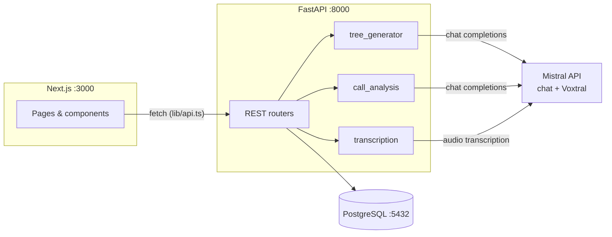

# CallTree

Decision-tree call guidance and auditing. Upload a procedure/spec document
(e.g. a police dispatch protocol or a customer-support playbook), let Mistral
generate a **ground-truth decision tree**, then:

1. **Guide** — an employee follows the tree live during a call through a big,
   simple step-by-step interface.
2. **Audit** — upload a recording of a past call; it is transcribed with
   **Voxtral** and judged by Mistral against the tree: which steps were
   followed, which were skipped or deviated from, with quotes and a 0-100
   adherence score.

## Architecture



- **Frontend**: Next.js 14 (App Router, TypeScript). Talks to the backend
  only through the typed client `frontend/lib/api.ts`.
- **Backend**: FastAPI + SQLAlchemy 2 + Poetry. Three AI services wrap the
  Mistral API: tree generation, Voxtral transcription, call judging. Audio
  files are stored on local disk (`backend/media/`), not in the DB.
- **DB**: PostgreSQL 16 in Docker. Trees are stored as a JSONB document (see
  contract below) — always read/written whole, so no normalized nodes table.
- **Contracts**: `backend/app/schemas.py` (Pydantic) and
  `frontend/lib/types.ts` are mirrors — change both together.
  `db/schema.sql` and `backend/app/models.py` are mirrors too.

### Repository layout

```
├── package.json              # root npm scripts: setup, dev, db, db:down, db:reset
├── scripts/dev.mjs           # OS-agnostic launcher (plain Node, no deps)
├── docker-compose.yml        # PostgreSQL (schema auto-applied on first start)
├── db/schema.sql             # DB source of truth + JSONB shape docs
├── backend/
│   ├── pyproject.toml        # Poetry
│   └── app/
│       ├── main.py           # FastAPI wiring (done)
│       ├── config.py         # env settings (done)
│       ├── database.py       # SQLAlchemy session (done)
│       ├── models.py         # ORM models (done)
│       ├── schemas.py        # API contract (done)
│       ├── routers/          # specs, trees, sessions, calls — TO IMPLEMENT
│       └── services/         # tree_generator, transcription, call_analysis — TO IMPLEMENT
├── frontend/
│   ├── lib/types.ts          # TS mirror of schemas.py (done)
│   ├── lib/api.ts            # typed fetch client (done)
│   ├── app/                  # pages (done, except audit — TO IMPLEMENT)
│   └── components/           # done, except AudioUploader + CallReport — TO IMPLEMENT
├── notebooks/scripts/        # data-download scripts (uv-managed, see pyproject.toml)
├── test-data/                # small git-tracked sample of MultiWOZ 2.2 for reference
└── .agents/                  # agent skills, e.g. access-multiwoz-data
```

### Training/reference data

The demo trees can be validated against MultiWOZ 2.2 (task-oriented dialogues).
See [`.agents/access-multiwoz-data/SKILL.md`](.agents/access-multiwoz-data/SKILL.md)
for how to get access and download it; [`test-data/`](test-data/) has a small
tracked sample so you can see the shape of the data without downloading anything.

Every `TO IMPLEMENT` file contains a stub with a detailed docstring/comment
spec — that comment is the task description.

### Tree JSON contract

The one shape everything depends on (`trees.structure` in the DB,
`TreeStructure` in schemas.py/types.ts):

```json
{
  "root_id": "n1",
  "nodes": {
    "n1": {
      "id": "n1",
      "type": "question",
      "label": "Emergency?",
      "prompt": "Ask: 'Is anyone in immediate danger right now?'",
      "options": [
        { "label": "Yes", "next_id": "n2" },
        { "label": "No", "next_id": "n3" }
      ]
    },
    "n2": { "id": "n2", "type": "end", "label": "Dispatch", "prompt": "Say: 'Units are on the way. Stay on the line.'", "options": [] }
  }
}
```

Rules: `question` nodes have ≥2 options, `action` nodes exactly 1
("Continue"), `end` nodes none. Every `next_id` must resolve; every path must
reach an `end` node.

### API summary

| Method | Path | Purpose |
|---|---|---|
| POST | `/api/specs` | Upload spec document (multipart) |
| GET | `/api/specs` | List specs |
| POST | `/api/specs/{id}/generate-tree` | Generate tree via Mistral (slow, ~10-30s) |
| GET | `/api/trees` · `/api/trees/{id}` | List / get trees |
| PUT | `/api/trees/{id}` | Save manual edits as a new version |
| POST | `/api/sessions` | Start a guided session |
| GET | `/api/sessions/{id}` | Get session + current node |
| POST | `/api/sessions/{id}/step` | Record a choice, advance |
| POST | `/api/sessions/{id}/finish` | Complete/abandon the session |
| POST | `/api/assist` | Operator copilot chat, grounded in the tree |
| POST | `/api/calls` | Upload audio + transcribe with Voxtral (slow) |
| GET | `/api/calls/{id}` | Get call + transcript |
| POST | `/api/calls/{id}/analyze` | Judge call vs. tree via Mistral (slow) |
| GET | `/api/calls/{id}/analysis` | Latest analysis |

Full request/response specs live in the router docstrings
(`backend/app/routers/*.py`); interactive docs at
`http://localhost:8000/docs` once running.

## Install & run

Prerequisites: **Docker**, **Python 3.11+** with **Poetry**, **Node 18+**,
and a **Mistral API key** (console.mistral.ai).

### Quick start (one command)

From the repo root (works on Windows, macOS and Linux — the launcher is
plain Node, no `npm install` needed at the root):

```bash
npm run setup   # first time: creates env files, installs all dependencies
                # then put your MISTRAL_API_KEY in backend/.env
npm run dev     # starts DB + backend + frontend together
```

`npm run dev` re-checks setup (cheap), starts Postgres (Docker, schema
auto-applied), waits for it to be ready, then runs the FastAPI backend
(:8000) and the Next.js frontend (:3000) with prefixed `[api]`/`[web]` logs.
Ctrl-C stops both; if one crashes the other is stopped too. The DB container
stays up — `npm run db:down` stops it, `npm run db:reset` wipes and
recreates it.

The manual steps below do the same thing service by service — useful when you
only work on one of them.

### 1. Database

```bash
docker compose up -d db
```

`db/schema.sql` is applied automatically on first start. To reset the DB:
`docker compose down -v && docker compose up -d db`.

### 2. Backend

```bash
cd backend
poetry install
cp .env.example .env        # then put your MISTRAL_API_KEY in .env
poetry run uvicorn app.main:app --reload --port 8000
```

Check: `curl http://localhost:8000/api/health` → `{"status":"ok"}`.

### 3. Frontend

```bash
cd frontend
npm install
cp .env.example .env.local
npm run dev
```

Open http://localhost:3000.

## Demo flow

1. Home page → upload a spec (PDF/txt/md) → tree is generated → tree view.
2. Switch to **Guide** (tabs in the top bar) → step through the call with big
   buttons or the 1-9 number keys → finish. The bottom chat bar answers
   procedure questions via `/api/assist`.
3. **Tree** mode → browse the full tree, click a node to edit wording or
   branches → "Save as v2" (new version, old sessions keep the old one).
4. Audit (still to build) → upload an mp3/wav of a (staged) call →
   transcript → "Analyze" → score, per-step verdicts with quotes.

Tip: record your own 2-minute fake call following (and deliberately breaking)
the tree — a call with one obvious deviation makes the best demo.

## Suggested split (frontend is implemented, backend is the critical path)

- **A (backend core)**: routers `specs.py`, `trees.py`, `sessions.py` — pure
  CRUD + path logic, no AI. Unblocks the whole UI; start here.
- **B (backend AI)**: `services/` (tree_generator, transcription,
  call_analysis) + routers `calls.py` and `assist.py`. Owns the Mistral
  prompts.
- **C (frontend audit)**: the only frontend still stubbed — audit page,
  `AudioUploader`, `CallReport`.

Ground rules: schemas.py / types.ts / schema.sql are frozen contracts —
changing one means changing its mirror in the same commit and telling the
team. B and D can develop against hardcoded fixture JSON before A finishes.
