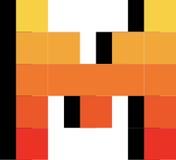

# Why

## The situation {background-image="assets/situation-callcenter.jpg" background-opacity="0.45"}

**Same policy. Told once. Checked never.**

::: {.notes}
Procedure-driven calls — dispatch protocols, support playbooks, KYC
scripts — need to be followed consistently. Today that breaks down on both
ends: live, agents forget steps under pressure, especially edge cases.
After the fact, nobody has time to listen back and check every call against
policy. Onboarding a new agent to a written policy PDF is slow and
inconsistent from person to person.
:::

## Guide — follow the script, live {background-image="assets/guide-agent.jpg" background-opacity="0.5"}

::: {.kicker}
Use case 1 — the human on the call
:::

**One question at a time. Nothing to memorize.**

::: {.notes}
This is the first and primary use case: a live, big-button UI that walks an
agent through the decision tree during the call itself, one question at a
time. The agent actively works through the script as the conversation
happens instead of hunting through a policy PDF. This is the demo
centerpiece — upload a spec, Mistral (mistral-large-latest) turns it into
the tree, and the agent is guided node by node, live, on the next call they
take.
:::

## Audit — check the call after the fact {background-image="assets/audit-review.jpg" background-opacity="0.5"}

::: {.kicker}
Use case 2 — checking how agents did
:::

**Same tree. Now it grades the call.**

::: {.notes}
The second use case closes the loop: upload a recording of a past call,
Voxtral transcribes it, and Mistral judges the transcript against the same
tree the agent was guided by — which steps were followed, skipped, or
deviated from, with supporting quotes, and a 0–100 adherence score. Same
ground truth as Guide, so what agents are told to do and what they're
graded on can never drift apart.

Demo data: no real recordings for a hackathon, so we synthesize calls from
MultiWOZ 2.2 dialogues already vendored in test-data/sample_dialogues.json,
restyled as support-call scripts — e.g. a restaurant-booking dialogue
becomes greet → gather cuisine/area → gather party size & time → confirm
booking. We generate one call that follows the tree cleanly and one that
deliberately skips a step, so the scoring UI has something to catch live.
:::

# How

## Architecture

```{mermaid}
flowchart LR
  subgraph Frontend [Next.js :3000]
    UI[Pages & components]
  end
  subgraph Backend [FastAPI :8000]
    API[REST routers]
    TG[tree_generator]
    TR[transcription]
    CA[call_analysis]
  end
  DB[(PostgreSQL :5432)]
  M[Mistral API<br/>chat + Voxtral]

  UI -- "fetch (lib/api.ts)" --> API
  API --> DB
  API --> TG & TR & CA
  TG & CA -- chat completions --> M
  TR -- audio transcription --> M
```

::: {.notes}
Next.js frontend talks only through a typed client (lib/api.ts) to FastAPI.
Three Mistral-backed services: tree_generator, transcription, call_analysis.
Trees are stored as a single JSONB document in Postgres, always read and
written whole — no normalized nodes table needed at this scale. Audio files
land on local disk (backend/media/), not in the DB.
:::

## The tree contract

```{mermaid}
graph TD
  n1{"n1 · Emergency?"} -->|Yes| n2["n2 · end<br/>'Units are on the way.<br/>Stay on the line.'"]
  n1 -->|No| n3["n3 · question<br/>Next step…"]
```

::: {.notes}
TreeStructure = root_id + a nodes map — the one shape the generator, the
guide UI, and the judge all share. question nodes have two or more options,
action nodes exactly one ("Continue"), end nodes none. Every next_id must
resolve, every path must reach an end. Trees are immutable per version —
edits insert version = max + 1, so sessions and past calls keep pointing at
the version they started with; history never quietly changes underneath
them.
:::

## Powered by Mistral

{width="180"}

| Task | Model |
|---|---|
| Tree generation | `mistral-large-latest` |
| Call judging | `mistral-large-latest` |
| Transcription | `voxtral-mini-latest` |

::: {.notes}
Tree generation and call judging both use mistral-large-latest in JSON
mode, validated with Pydantic, one retry on bad JSON before failing.
Transcription uses voxtral-mini-latest to turn a call recording into a
timestamped, speaker-labeled transcript.
:::

## What's next {background-image="assets/roadmap-voice.jpg" background-opacity="0.5"}

**🔊 Text-to-speech: hear the next line, don't just read it**

::: {.notes}
Next extension phase: read the agent's next scripted line out loud,
hands-free, during a live call — closing the Guide loop with voice instead
of eyes glued to a screen. No TTS exists in the codebase today — Voxtral
only does speech-to-text — so this is a genuinely new direction, not a
tweak of something already built.

Also on the roadmap: real-time in-call judging (flag a deviation while the
call is still happening, not after), and multi-language tree generation and
judging.
:::

## Thank you {background-image="assets/cat-2.gif" background-opacity="0.22"}

**Questions?**

{.absolute bottom="30" right="30" width="140" style="border-radius: 12px;"}

::: {.notes}
CallTree — upload the procedure once, then let Mistral both guide the call
live and grade it after the fact. Fun fact: Mistral's own logo hides a cat
— early ML's favorite training subject, and ours too.
:::
